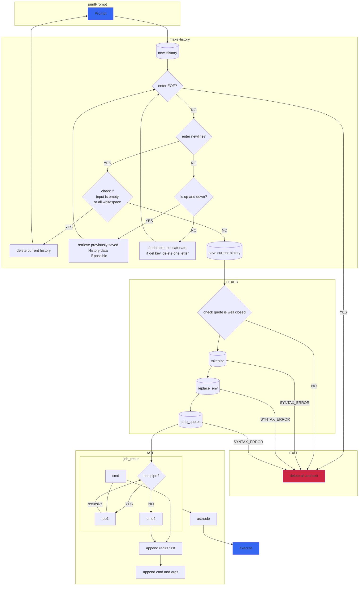

# minishell
# the order in implementation
1. show prompt
2. make history
3. lexing into tokens
4. make ASTree from tokens
5. execute ASTree
6. handling signal

1. lexer - 평문을 ' ', '<', '<<', '>', '>>', '|' 에 나눠 토큰화한다. 토큰화 과정 중에 큰 따옴표 혹은 평문 내의 환경변수를 환경변수 값으로 치환한다.  
2. astree - pipe(|)을 루트노드로 기준으로 두고 cmd를 왼쪽, 오른쪽 노드로 분기시킨다. 이 때, a << b >> c 같은 리디렉션이 여러개 있을경우, 리디렉션 노드를 먼저 연결 후 일반 노드를 연결한다 (<<b 오른쪽자식노드에 >>c 오른쪽자식노드 연결후, 그 오른쪽자식노드에 a 일반노드를 연결)  
a << b >> c |(1) d < e > f |(2) g 를 예시로 들어보면,  
루트노드에는 1번파이프가 있다. 루트노드의 오른쪽 노드에는 2번파이프가 있다.  
1번파이프 노드의 왼쪽노드에는 <<b 리디렉션노드가 있고, 그 노드의 오른쪽노드에는 >>c 리디렉션노드가 있으며, 그 노드의 오른쪽노드에는 a 일반노드가 있다.  
2번파이프 노드의 왼쪽노드에는 <e 리디렉션노드가 있으며, 그 노드의 오른쪽노드에는 >f 리디렉션노드가 있고, 그 노드의 오른쪽노드에는 d 일반노드가 있다.  
2번파이프 노드의 오른쪽노드에는 g 일반노드가 있다.  
3. execute - job 분기 갯수마다 자식프로세스를 실행시킨후, astree를 순회하며 필요에 따라 표준 입출력 방향 변환 후 명령어를 실행한다.  
[아쉬운점]  
astree노드 구성 시 리디렉션 노드들을 계속 오른쪽 자식의 노드에 연결하는 점이 있다. execute할 때에만 전체 노드의 정보를 가져오기 위해 전체 순회하는데, 기왕 다 순회하는거 오른쪽으로만 계속 뻗는게 문제가 될까 싶다.
