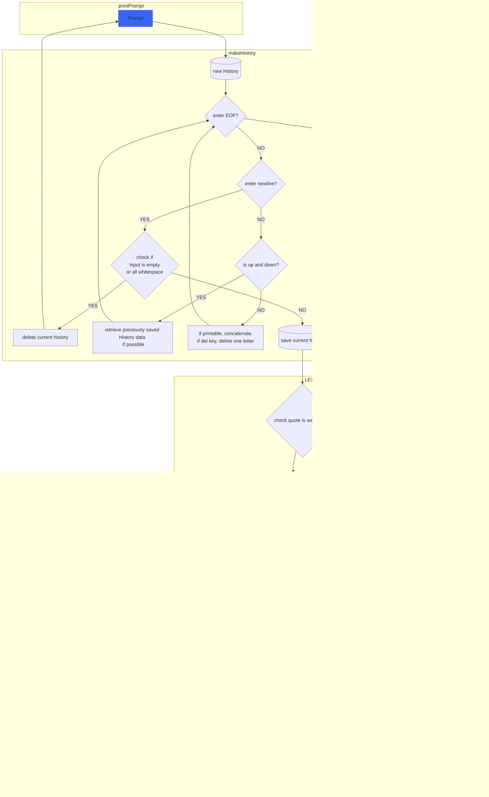

# minishell
# the order in implementation
1. show prompt
2. make history
3. lexing into tokens
4. make ASTree from tokens
5. execute ASTree
6. handling signal

1. lexer - 평문을 ' ', '<', '<<', '>', '>>', '|' 에 나눠 토큰화한다. 토큰화 과정 중에 큰 따옴표 혹은 평문 내의 환경변수를 환경변수 값으로 치환한다.
